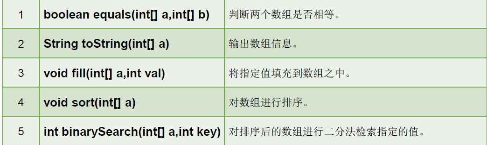

<center>
    <h1>
        leetcode算法题总结
    </h1>
</center>
## 面试准备

### 1 **算法准备**

* 面试算法：codeTOP算法，200道题目左右
  * 三星星：快速过
  * 二星：写1遍
  * 一星：写2遍
  * **[牛客面试网站](https://interview.nowcoder.com/interview/23347115/interviewee?code=BoYuiE4y#/exam)**
  * pycharm的debug功能
* 笔试算法：
  * 牛客网上：各大公司的往年笔试题


### 2 面试准备

* 实习多久，有没有转正
* 日常薪资，打车，餐补
* 实习证明
* 那个项目组


[java进阶项目](https://doocs.github.io/advanced-java/#/)：分布式，微服务，缓存

[计算机基础](https://github.com/wolverinn/Waking-Up)：计算机网络 + 操作系统 + 数据库  + 设计模式

[JavaGuide面试突击版](https://snailclimb.gitee.io/javaguide-interview/#/)：java八股文


* **自我介绍**：强调自己会的部分，计算机基础，javaSE多线程，减少项目内容。
  
  * 一份对hr说的，主要讲能突出自己的经历，会的编程技术一语带过；
  * 另一份对技术面试官说的，主要讲自己会的技术细节和项目经验。
  
  >面试官您好，我叫易林志，现在是北航计算机学院的一名研二学生。在科研方面，我主要是跟着导师做医学图像处理，使用深度学习模型，对医学图形上的病灶进行分割处理，主要研究损失函数对于图像分割的激励作用。在开发方面，我通过研究生阶段的一个课程设计，完成了一个在线教育系统。在线教育系统主要分成前台用户系统和后台管理系统。前端主要使用Vue架构，后端通过SpringBoot+SpringCloud Alibaba进行微服务架构。在功能方面，通过使用redis提升了首页的访问速率，借助jwt完成了用户登陆鉴权，使用Autho2完成了第三方开发系统授权等功能。在技能方面，我对java基础，java容器等方面有所掌握，了解计算机网络，操作系统等方面的知识，使用过mysql，redis等数据库。最后，我希望能获得一个后端开发的实习机会。
  >
  >我在其中主要担任后端开发，主要负责了权限管理功能模块的搭建。
  >
  >用redis做缓存提高访问速度和并发量、使用消息队列削峰
  
* 计算基础部分
  * 计算机网络：整理
  * 操作系统：整理，认真复习

* 数据库复习
  * mysql：整理
  * redis：整理 + 进阶知识
  * rabbitMQ：稍微复习

* java部分：开始复习
  * javase基础 + javase_oop + javase容器 + javase多线程

  * jvm学习

  * java面试题

* 项目部分：

  >  就会针对表的设计，一些模块的设计思路，还有场景问题
  >
  > 所以这时候我们就需要来考察思维散发的能力，就比如看你解决事务的能力，大多是出一些场景问题看你的解决方法这样子

  * **[java进阶知识](https://doocs.github.io/advanced-java/#/)**：场景问题
  * java类之间的关系，表格之间是一对一，还是一堆多
  * 微服务这块：哪些微服务，具体如何调用，对微服务的理解
  * jwt原理，具体流程
  * autho2
  * 统计微服务
  * 订单微服务
  * redis中队不同数据，采用的数据类型，版本迭代，缓存失效如何解决
  * nacos分布式集群部署
  
* 待学习内容

  * kafka学习

  * zookeeper学习

  * git、github复习

    


细分

* 习惯
* 工作
* 规划
* 发展


**面试参考**

* [字节飞书，技术中台,人力套件,客服中台后台开发面经](https://www.nowcoder.com/discuss/692658?type=post&order=recall&pos=&page=1&ncTraceId=&channel=-1&source_id=search_post_nctrack&gio_id=BBB1BE91388673C7040C91E0D4842FFE-1645667567414)
* [阿里云某部门面试](https://www.nowcoder.com/discuss/846384?type=all&order=recall&pos=&page=1&ncTraceId=&channel=-1&source_id=search_all_nctrack&gio_id=BBB1BE91388673C7040C91E0D4842FFE-1646235247261)
* [Redis面试八股文（带答案）](https://www.nowcoder.com/discuss/848513?type=1&channel=-1&source_id=discuss_terminal_discuss_hot_nctrack)
* [阿里云日常实习一面](https://www.nowcoder.com/discuss/846181?type=all&order=recall&pos=&page=1&ncTraceId=&channel=-1&source_id=search_all_nctrack&gio_id=BBB1BE91388673C7040C91E0D4842FFE-1646236099528)
* [阿里巴巴后端实习](https://www.nowcoder.com/discuss/842756?type=all&order=recall&pos=&page=1&ncTraceId=&channel=-1&source_id=search_all_nctrack&gio_id=BBB1BE91388673C7040C91E0D4842FFE-1646236099528)
* [阿里后端面经](https://www.nowcoder.com/discuss/818065?type=all&order=recall&pos=&page=1&ncTraceId=&channel=-1&source_id=search_all_nctrack&gio_id=BBB1BE91388673C7040C91E0D4842FFE-1646236099528)
* [3月4日，阿里电话一面(已凉) ](https://www.nowcoder.com/discuss/854877?type=2&channel=-1&source_id=discuss_terminal_discuss_hot_nctrack)
* [互联网java进阶面试知识](https://doocs.github.io/advanced-java/#/)

### 3 面试进度投递

| 公司           | 职位       | 进度 | 面试 | 结果               |
| -------------- | ---------- | ---- | ---- | ------------------ |
| ~~openmmlab~~  | 后端开发   | 投递 | 2.25 | 一面失败：项目经验 |
| ~~阿里云~~     | 云数据管控 | 投递 | 3.08 | 一面失败：项目场景 |
| 蚂蚁金融：SRE  | 后端开发   | 投递 |      |                    |
| ~~美团：到家~~ | 后端开发   | 投递 | 3.16 | 一面失败：思考不足 |
| ~~网易：有道~~ | 后端开发   | 投递 |      | 简历没通过         |
| 蔚来：对话系统 | 后端开发   | 投递 | 3.21 | 一面通过           |
| 华为：         | 后端开发   | 投递 |      |                    |
| 百度：         | 后端开发   | 投递 |      |                    |
| 纠纷逍客       | 后端开发   | 投递 | 3.21 |                    |
| 便利蜂         | 后端开发   | 投递 |      |                    |
| ~~货拉拉~~     | 后端开发   | 投递 |      | 二面通过：hc已满   |
| 旷视           |            |      |      |                    |
| keep           |            |      |      |                    |
| ~~快手~~       | 后端开发   | 投递 |      | 简历没通过         |
| 京东           |            |      |      |                    |
| 小米           |            |      |      |                    |
| 字节           | 日常       |      |      |                    |
| 腾讯           |            |      |      |                    |
| shoppee        |            |      |      |                    |
| 微软           |            |      |      |                    |
| hulu           |            |      |      |                    |
| B站            |            |      |      |                    |
| 其它           |            |      |      |                    |
|                |            |      |      |                    |


**待补充：大数相加，相乘，相除，位运算**

每道题：

* 最开始注意特殊情况判断，要先写。
* 分析技巧 + 时间复杂度。

## 一 题目类型分类

### 1 算法策略

替换策略

[146. LRU 缓存](https://leetcode-cn.com/problems/lru-cache/)🆗 🆗  

* LRU：从最近使用时间上而言，被访问或者创建，都需要移到队首，**双向链表**
  * get: 哈希表查找快，但是数据无固定顺序；
  * put: 链表有顺序之分，插入删除快，但是查找慢。结合一下，形成一种新的数据结构：哈希链表。

* 易错点：
  * 删除链表结点，链表结点移动。
  * 创建，删除结点：内存，长度，map，以及是否放到队首。


[460. LFU 缓存](https://leetcode-cn.com/problems/lfu-cache/) n🆗

* Node：key, val ,freq，**普通结点**
* cache<key, Node>： put/get -> freqIncr/addNode/removeNode
* freqMap<freq, LinkedHashSet\<Node> >:  LFU，LinkedHashSet保证插入顺序


**定义一个新的数据结构**

* 定义内部类
* 定义构造函数
* 定义属性
* 定义方法


### 2 数据结构类的相互实现

**栈，队列**

[155. 最小栈](https://leetcode-cn.com/problems/min-stack/)🆗 a

* 辅助栈：单调递减栈

[232. 用栈实现队列](https://leetcode-cn.com/problems/implement-queue-using-stacks/)🆗 a

* 易错点：入栈向出栈转移时候，使用while循环清空入栈元素。

[225. 用队列实现栈](https://leetcode-cn.com/problems/implement-stack-using-queues/) n 🆗

* 借助辅助队列：加入元素，先把主队元素放到副队中，加入元素，在把之前元素放回来

  * 注意：队列只能使用offer，poll，peek方法。
  
  

### 3 数组问题

* 子序列：保存相对顺序，不要求连续

* 字串，子数组：连续


#### 3.1 动态规划

[动态规划：无后效性](https://leetcode-cn.com/problems/maximum-subarray/solution/dong-tai-gui-hua-fen-zhi-fa-python-dai-ma-java-dai/)

* 子问题的描述还有不确定的地方，这件事情叫做**有后效性**。我们要消除这种后效性。

* 状态定义，确定选择以nums[i]结尾；最终的结果要采用变量进行更替比较。


[300. 最长**递增子序列**](https://leetcode-cn.com/problems/longest-increasing-subsequence/)🆗 a

* 动态规划
  * 状态定义：选择nums[i]为结尾，不连续
  * 状态转移：最长限制，max(dp[i],dp[j]+1)，必须使用max，否则反例1，3，4，2，5。
* 二分法：推荐，降低时间复杂度，O(nlogn)
  * 每个元素：寻找插入的左边界，**维持严格单调递增**
  * res记录最大的长度
* 区别：最长**递增子数组**
  * 从前往后，和上一个元素进行比较即可。


[字节补充：圆环回原点问题](https://mp.weixin.qq.com/s/NZPaFsFrTybO3K3s7p7EVg)🆗a R

* 动态规划

  * 状态定义：二维数组，两个状态
    * 
    * 数组的取值范围：步数可以从0开始，其余在0~n-1之间
    * 注意初始化条件，可以从状态转移方程得到合适解释。
  

[494. 目标和](https://leetcode-cn.com/problems/target-sum/) a 🆗 R

* 动态规划
  * 状态定义：二维数组，注意dp\[i][j]中j的取值范围和下标范围的区别，求个数
    * 两个状态：记录数字选择范围的下标，j为target
    * **target有正，有负**
    * 初始化

[416. 分割等和子集](https://leetcode-cn.com/problems/partition-equal-subset-sum/) n🆗 R

* 动态规划
  * 状态定义：二维数组，是否，dp\[i][j]：组合范围，能否构成j
    * 0-1背包问题的变体。
    * 仔细体会和上面两个的区别：是否/个数，连续还是范围


[53. 最大**子数组和**](https://leetcode-cn.com/problems/maximum-subarray/)🆗 a

* 动态规划

  * 状态定义：dp[i]以i结尾的最大子序列和

  * 状态初始化可以放到状态转移方程中
  

[剑指 Offer 10- II. 青蛙跳台阶问题](https://leetcode-cn.com/problems/qing-wa-tiao-tai-jie-wen-ti-lcof/)🆗 🆗

* 动态规划
  * 转移方程
  * 注意特殊情况判断+初始化的设置。
  * 空间优化：注意迭代次数。
* 可以看成排列问题，给定target和数组[1,2]进行排列，和零钱组合问题联系与区别。


**股票系列**


**环形动态规划**

[美团笔试：回转寿司](https://www.nowcoder.com/questionTerminal/5a2a527f68b6434ba0b4faadcdc97812?orderByHotValue=1&questionTypes=000101&page=1&onlyReference=false)


**正向+ 反向动态规划**

[美团笔试题解：第二题](https://blog.csdn.net/qq_38649940/article/details/123292226?spm=1001.2014.3001.5502)

[238. 除自身以外数组的乘积](https://leetcode-cn.com/problems/product-of-array-except-self/) n 🆗

* 动态规划：正向 → 反向


**二维状态**

[合并金币](https://www.nowcoder.com/question/next?pid=21910856&qid=894497&tid=53627956)


[剑指 Offer 10- I. 斐波那契数列](https://leetcode-cn.com/problems/fei-bo-na-qi-shu-lie-lcof/)n 🆗

* 动态规划
  * 注意：求和马上取余


[剑指 Offer 62. 圆圈中最后剩下的数字](https://leetcode-cn.com/problems/yuan-quan-zhong-zui-hou-sheng-xia-de-shu-zi-lcof/)n 🆗

* 约瑟夫问题：动态规划
  * 状态转移：反推，(n-1,m)→(n,m)


#### 3.2 连续子数组

**连续子数组问题解法**

* 前缀和：整数求和，=k

* 滑动窗口：正整数求和，>=k

* 动态规划：最大求和

  

**求和：限制了一个数**

[560. 和为 K 的子数组：整数](https://leetcode-cn.com/problems/subarray-sum-equals-k/) n 🆗

* 前缀和：
  * **借助map，记录前缀和和对应的次数**
  * 前缀为0的时候，次数为1。
  * 注意，本题不能采用滑动窗口，在于左端确定后，右端可能存在多个对应端点，因为是整数，某段区间和可能为0。

[862. 和至少为 K 的最短子数组：整数](https://leetcode-cn.com/problems/shortest-subarray-with-sum-at-least-k/) n 🆗 R

* **前缀和：前缀和一共是n+1个**
  * **严格单调递增队列**：最短min，和>=k
    * 严格单调递增：比如[1,4,4]，后面相同元素计算出的长度，肯定大于前面
    * 下标入队：最后计算长度，采用下标。
      * 先维持单调性，然后对每个元素计算可能的结果。
  * 对于n个数字，前缀和有n+1个。其中0就是第一个前缀和。
  * 理解：**preSum[j]-preSum[i]：对应闭区间：str[0:j-1]-str[0:i-1]=str[i:j-1]，长度：j-1**。
  * 本题难点在于数组中的数据可能为负数，如果数组中的数据均为非负数的话，那么就对应常规的子数组和问题，可以使用滑动窗口来解决。但是添加了负数之后，窗口的滑动便丢失了单向性，因此无法使用滑动窗口解决。

[209. 长度最小的子数组：正整数，>=target](https://leetcode-cn.com/problems/minimum-size-subarray-sum/) n 🆗

* 滑动窗口。

  * 和第1，2题相比，元素变成了正整数，保证了前缀和的单调性，因此可以采用滑动窗口。


**最大求和**

[53. 最大子数组和](https://leetcode-cn.com/problems/maximum-subarray/) 🆗 a

* 动态规划

  * dp[i]：以i结尾的最大子序列和，更替记录中间最大状态。


**乘积**

[152. 乘积最大子数组](https://leetcode-cn.com/problems/maximum-product-subarray/)n 🆗

* 动态规划

  * 不同点，前面三个相加，这个相乘。
  * 定义状态：无后效性，选择以nums[i]结尾。
    * 同时注意：**存在负数**，相乘会改变最大，最小值，所以同时定义两个状态，更替记录中间最大状态。
    * 参考[题解](https://leetcode-cn.com/problems/maximum-product-subarray/solution/dong-tai-gui-hua-li-jie-wu-hou-xiao-xing-by-liweiw/)
  * 152和53的状态定义方式类似：无后效性
    * 此时状态初始化可以放到状态转移方程里
  
  
  


#### 3.3 买股票问题

首先通过最基础的动态规划理解，参考[股票问题](https://leetcode-cn.com/problems/best-time-to-buy-and-sell-stock/solution/bao-li-mei-ju-dong-tai-gui-hua-chai-fen-si-xiang-b/)

* 状态定义：使用数组记录状态，从约束条件进行定义，满足无后效性。
* 状态转移：状态从前往后变化
* 状态初始化
* 空间优化

动态规划：

- 动态规划用于求解 **多阶段决策问题** ；
- 动态规划问题的问法：**只问最优解，不问具体的解**；
- 掌握 **无后效性** 解决动态规划问题：把约束条件设置成为状态。

总结：动态规划有两种求解形式：

* 自顶向下：也就是记忆化递归，求解过程会遇到重复子问题，所以需要记录每一个子问题的结果；
* 自底向上：通过发现一个问题最开始的样子，通过「递推」一步一步求得原始问题的解。

在「力扣」上的绝大多数问题都可以通过「自底向上」递推的方式去做。


**股票问题通解**：采用动态规划的空间优化算法

* 每个位置存在两种状态，dp\[i][2]，买还是卖，最后空间优化成两个变量。

* 最大化buy（持股，买入股票，-p）和最大化sell（不持股，卖出股票，+p）。

* 状态转移方程：先buy，后sell。

* 具体思路参考[5行代码搞定所有股票买卖问题](https://leetcode-cn.com/problems/best-time-to-buy-and-sell-stock-iv/solution/5xing-dai-ma-gao-ding-suo-you-gu-piao-ma-j6zo/)：

  * 买一次和多次，两个变量；买两次和k次数，多个变量。注意buy和sell初始化设置和状态转移，先买后买。
  * 跳出固有的思维模式，并不是要考虑买还是卖，而是要最大化手里持有的钱。买股票手里的钱减少，卖股票手里的钱增加，无论什么时刻，我们要保证手里的钱最多。我们这一次买还是卖只跟上一次我们卖还是买的状态有关

  

[121. 买卖股票的最佳时机：一次](https://leetcode-cn.com/problems/best-time-to-buy-and-sell-stock/)🆗 a

* 遍历+标记最小值

[122. 买卖股票的最佳时机 II：无限制](https://leetcode-cn.com/problems/best-time-to-buy-and-sell-stock-ii/)🆗 a

* 贪心

[123. 买卖股票的最佳时机 III](https://leetcode-cn.com/problems/best-time-to-buy-and-sell-stock-iii/)🆗 a

[188. 买卖股票的最佳时机 IV](https://leetcode-cn.com/problems/best-time-to-buy-and-sell-stock-iv/)🆗 a

* **注意k和len(prices)/2的大小，取最小值，防止退化后无效买卖。**
* 状态的定义：将时间维度消除，仅仅保存次数维度。

[309. 最佳买卖股票时机含冷冻期](https://leetcode-cn.com/problems/best-time-to-buy-and-sell-stock-with-cooldown/)🆗a 

* **三个变量：buy，sell_pre，sell_now，注意变量如何更新。**
* 卖完要隔一天才能买，那么就多记录上一次卖的状态即可。

[714. 买卖股票的最佳时机含手续费](https://leetcode-cn.com/problems/best-time-to-buy-and-sell-stock-with-transaction-fee/) 🆗a

* 和多次买入类似，就是多了一个费用。


#### 3.4 会议室问题

二维数组排序问题，比较匿名实现类

[252. 会议室1：能否参加](https://leetcode-cn.com/problems/meeting-rooms/) n 🆗

* 是否有重叠区域，排序后比较。

[253. 会议室 II：会议室数目](https://leetcode-cn.com/problems/meeting-rooms-ii/) n 🆗

* 两个端点都要入队排序，变成二维数组排序问题
  * 不同于重叠区域，采用上车下车思想，开始一个会议上车+1，结束一个会议下次-1。结束pair<int,int>标记上下车。

[56. 合并区间](https://leetcode-cn.com/problems/merge-intervals/) 🆗 🆗

* 重叠区域合并，排序后比较，思想和会议室1思想相同。
  * 二维数组排序：lambda表达式


[1353. 最多可以参加的会议数目](https://leetcode-cn.com/problems/maximum-number-of-events-that-can-be-attended/) n 🆗 R

* 贪心算法
  * 先参加最先结束的，借助优先级队列
    * 先入队，后排除不可能，最后参会


#### 3.5 零钱兑换

参考[排列数和组合数的差别](https://leetcode-cn.com/problems/coin-change-2/solution/ling-qian-dui-huan-iihe-pa-lou-ti-wen-ti-dao-di-yo/)和其中评论：给定target，和数组，循环内外不同：排列还是组合！

[322. 零钱兑换：最小数目](https://leetcode-cn.com/problems/coin-change/)🆗 a

* 动态规划

  * 注意==状态dp[i]==，总量为i的最小零钱数目。初始值设置,其中dp[0]=0；

  * 状态转移方程：最小数目进行比较，采用min()。

[518. 零钱兑换 II：组合数目](https://leetcode-cn.com/problems/coin-change-2/)🆗 🆗

* 动态规划
  * 状态dp[i]，总量为i的零钱组合个数。初始值设置,其中dp[0]=1，什么都没选，也是一种组合；状态转移方程：**组合个数，采用累计+**。
  * 注意循环内外不同：排列还是组合。coins在外，选一次，为组合，不用考虑顺序。coins在内，可以选多次，为排列，参考[题解](https://leetcode-cn.com/problems/coin-change-2/solution/ling-qian-dui-huan-iihe-pa-lou-ti-wen-ti-dao-di-yo/)


[279. 完全平方数](https://leetcode-cn.com/problems/perfect-squares/) n 🆗

* 动态规划
  * 思想等同于[322. 零钱兑换：最小数目](https://leetcode-cn.com/problems/coin-change/)
    * Math.min


#### 3.6 子集，组合，排列

采用**递归回溯**，意思是每个位置有多种选择，因此需要变量start来确定选择当前选择i的范围，选择路径path在每个结点选择递归后需要回溯。

参考[回溯法思想](https://leetcode-cn.com/problems/permutations/solution/hui-su-suan-fa-python-dai-ma-java-dai-ma-by-liweiw/)，[回溯解法](https://leetcode-cn.com/problems/subsets/solution/c-zong-jie-liao-hui-su-wen-ti-lei-xing-dai-ni-gao-/)和[回溯法题目](https://leetcode-cn.com/problems/combination-sum/solution/xue-yi-tao-zou-tian-xia-hui-su-suan-fa-by-powcai/)


**子集和组合，不需要使用辅助数组标记是否访问，借助访问位置pos，只需要从前往后直接访问就行**

* 记录路径path和结果res，标记选择范围pos。
* Java中：res加入path，一定要使用副本！

[78.子集：不存在重复元素](https://leetcode-cn.com/problems/subsets/) 🆗 a

* 开始位置start，选择i：start-n-1→递归：开始位置为i+1。

[90.子集：存在重复元素](https://leetcode-cn.com/problems/subsets-ii/)🆗a

* 去除重复元素：先排序


[39.组合总和target：没有重复元素，但是可以重复使用](https://leetcode-cn.com/problems/combination-sum/) 🆗a

* 没有重复元素，组合就不可能重复。
* 开始位置start，选择i→递归：开始位置为i，可以重复选择。
* 递归边界 + 剪枝（不肯能组合）
  * 边界：`target ==0` ，记录+返回
  * 在递归前，就要将不满足的情况排除

[40.组合总和target：有重复元素，不可以重复使用，组合不能重复](https://leetcode-cn.com/problems/combination-sum-ii/) 🆗a

* 存在重复元素，需要排序。

* 开始位置start，选择i→递归：开始位置为i+1，**元素只能选择一次**。

* 剪枝

   * 重复组合
   * 不可能组合


类似题：[113.二叉树的组合问题](https://leetcode-cn.com/problems/path-sum-ii/) 🆗 a

   * 相同点：当前路径的选择+回溯，sum更替放到函数递归调用的实参里sum+...，从而只需对path回溯，无需对sum回溯。
   * 不同点：二叉树不用剪枝，记录和返回不同。
     * 叶子结点 + root.val == target：记录，并不返回


**排列：讲究内部顺序，需要使用标记数组used[]**

* 回溯1，path选择；回溯2，是否访问过。

[546.全排列：不包含重复元素](https://leetcode-cn.com/problems/permutations/) 🆗a R

* 标记数组是否使用，记录路径。
  * 递归边界：path个数达到。
  * 通过swap()，交换位置，从而避免使用标记数组。每次都选择当前开始位置pos，递归调用：开始位置pos+1。


[47.全排列：包含重复元素](https://leetcode-cn.com/problems/permutations-ii/)🆗a R

* 排序
* 使用标记数组
  * 产生重复选择：前后元素相同，且之前元素的选择被撤销


[51. N 皇后](https://leetcode-cn.com/problems/n-queens/) n 🆗 R

* 类似排序，采用辅助数组，标记访问位置，注意回溯。


**回溯**

[93. 复原 IP 地址](https://leetcode-cn.com/problems/restore-ip-addresses/)🆗 a

* 回溯法
  * 递归边界
  * 提前剪枝


#### 3.7 数字求和

[1.两数之和](https://leetcode-cn.com/problems/two-sum/) 🆗a

* 借助map，o(1)时间快速索引。
  * 每个元素都要加入map，加入前先判断。

[15.三数之和](https://leetcode-cn.com/problems/3sum/) 🆗a

* **双向指针**，left,right相向移动。
  * 先排序
  * 排除不可能情况 + **排除i，left，right重复情况**
  * 要区别，left/right移动和去重


#### 3.8 打家劫舍

[198.打家劫舍](https://leetcode-cn.com/problems/house-robber/) 🆗a

* 动态规划
  * 空间优化

[213.环形：打家劫舍](https://leetcode-cn.com/problems/house-robber-ii/) 🆗 a

* 环形数组，注意分别对两个数组片段求解最大值[0,n-1)，[1,n)。

[337.二叉树：打家劫舍](https://leetcode-cn.com/problems/house-robber-iii/) n 🆗 R

* 采用递归，要明白递归函数的作用，当前结点返回的最大值。
* 动态规划：一个结点有两个个状态，要定义二维数组，dp\[i][0/1]表示选择或者不选当前位置


#### 3.9 交换位置

**交换位置：双指针**

[283. 移动零](https://leetcode-cn.com/problems/move-zeroes/) n 🆗

* 一次遍历

[剑指 Offer 21. 调整数组顺序使奇数位于偶数前面](https://leetcode-cn.com/problems/diao-zheng-shu-zu-shun-xu-shi-qi-shu-wei-yu-ou-shu-qian-mian-lcof/) n 🆗

* 本质和移动零一样

[75.颜色分类排序：原地交换](https://leetcode-cn.com/problems/sort-colors/) n 🆗

* 一次遍历

  * 交换1时
  * 交换0时，可能把1进行交换
* 二次遍历

[26. 删除有序数组中的重复项](https://leetcode-cn.com/problems/remove-duplicates-from-sorted-array/) n 🆗 R

* 和上面题目的区别：
  * 上面idx：idx为结尾后一个位置
  * 此处idx：idx为结尾的位置


[169.多数元素](https://leetcode-cn.com/problems/majority-element/) 🆗🆗

* 从前往后，减而治之：投票法
  * 判断个数
  * 判断是否相等


#### 3.10 寻找顺序对

[31.下一个排列](https://leetcode-cn.com/problems/next-permutation/) n🆗

* **从后往前查找第一个顺序对(nums[i],nums[i+1])。**
  * 在找到顺序对的情况下，找到nums[i]后最大值nums[j]，交换位置。
  * 递减数组变成，递增数组，采用交换，而不是排序。

[556.下一个更大的数：下一个排列](https://leetcode-cn.com/problems/next-greater-element-iii/) n 🆗

* int → String → char[]
  * 本质：下一个排列，同时注意特殊情况，采用异常捕获


#### 3.11 从低位到高位

下面解法思想一样，参考[题解](https://leetcode-cn.com/problems/reverse-integer/solution/tu-jie-7-zheng-shu-fan-zhuan-by-wang_ni_ma/)。

* 先进行溢出判断，然后进行计算。

  

[7. 整数反转](https://leetcode-cn.com/problems/reverse-integer/) n 🆗

* `res = res*10 + num%10；num = num/10；`
* 是否溢出

[9. 回文数](https://leetcode-cn.com/problems/palindrome-number/) n 🆗

* 前半段和后半段对比

[8. 字符串转换整数 (atoi)](https://leetcode-cn.com/problems/string-to-integer-atoi/) 🆗 a

* 从前往后


#### 3.12 抽屉原理

>- 让数值 1 就放在索引位置 0 处；
>- 让数值 2 就放在索引位置 1 处；
>- 让数值 3 就放在索引位置 2 处；

[442. 数组中重复的数据](https://leetcode-cn.com/problems/find-all-duplicates-in-an-array/) n 🆗 R

* 符合排序：`nums[i] = nums[nums[i]-1]`

[448. 找到所有数组中消失的数字](https://leetcode-cn.com/problems/find-all-numbers-disappeared-in-an-array/) n 🆗


[287. 寻找重复数](https://leetcode-cn.com/problems/find-the-duplicate-number/) n 🆗 R

* 二分法 + 抽屉原理
  * 注意：left和right的取值范围，n+1个数值，范围[1,n]

* 回环链表法


#### 3.12 其它数组问题

[128. 最长连续序列：不要求联系](https://leetcode-cn.com/problems/longest-consecutive-sequence/) 🆗 a

* 集合，前面一个元素不在集合的元素开始统计。
* 子序列：不要求连续


**TOPK问题**：**求前K大/前K小/第K大/第K小**

[347.前 K 个高频元素](https://leetcode-cn.com/problems/top-k-frequent-elements/) n🆗

* 先变成对对象数组进行快排，对象属性：num和freq，排序依据freq

  * 递归函数

  * 辅助函数：partition()，注意和此时应该左大右小


**中位数**

[4.寻找两个正序数组的中位数](https://leetcode-cn.com/problems/median-of-two-sorted-arrays/)🆗 a R

* 两种方式

  * o(n)遍历：len/2+1次，借助pre + cur
    * 每次移动：每次两种情况，可以和 [ 88.合并两个有序数组](https://leetcode-cn.com/problems/merge-sorted-array/)对比
      * 首先保证数字下标存在，然后与上其它条件
  * o(log(len))：二分查找，
    * 每次实际截断的长度不一定是k/2，同时要先更新k，然后才更新坐标

* 易错点：**长度和下标的区别，这样才能避免是否越界**


[295.数据流的中位数：add()和findMid()](https://leetcode-cn.com/problems/find-median-from-data-stream/) n 🆗

* 借助两个优先级队列，左边：大顶堆，右边：小顶堆。
  * 注意：左右哪个非空，就和哪个队顶进行比较


**单调栈或单调队列**

[402. 移掉 K 位数字](https://leetcode-cn.com/problems/remove-k-digits/)n 🆗 R

* **单调递增栈（可重复）**：只需要栈顶入栈，出栈，维持单调性和移除k的个数目
  * 元素入栈，计算最后结果
    * 入栈的时候，就考虑排除前置0
    * 最后变成字符串考虑，处理前置0
  

[739. 每日温度](https://leetcode-cn.com/problems/daily-temperatures/) 🆗 a

* 严格单调递减栈
  * 下标入栈：下标计算结果

[503. 下一个更大元素 II：循环数组](https://leetcode-cn.com/problems/next-greater-element-ii/) n 🆗 R

* 单调递减栈（可重复）：栈顶操作即可
  * 下标入栈，当出现递增的时候，就可以更新记录

[862. 和至少为 K 的最短子数组：整数](https://leetcode-cn.com/problems/shortest-subarray-with-sum-at-least-k/) n 🆗

* 严格单调递增队列：队尾入栈，队首出栈
  * 长度：下标入栈

  

[ 88.合并两个有序数组](https://leetcode-cn.com/problems/merge-sorted-array/)🆗🆗

* 终止条件
* 每步移动条件：首先本索引存在，然后考虑其它因素。

[287.寻找重复数：n+1个数，数值限制在1-n](https://leetcode-cn.com/problems/find-the-duplicate-number/)🆗🆗

* 类似环形链表入环结点（此时可定存在），推荐
* 二分法：抽屉原理

[41. 缺失的第一个正数](https://leetcode-cn.com/problems/first-missing-positive/)🆗🆗

* 原地哈希
  * 对符合范围的数值进行标记，采用下标对应，同时注意正，负特性。

[670. 最大交换](https://leetcode-cn.com/problems/maximum-swap/)n🆗 R

* 从后往前，为每个位置，确定最大值的下标


**利用排序**

[215. 数组中的第K个最大元素](https://leetcode-cn.com/problems/kth-largest-element-in-an-array/)🆗🆗

* 利用快排的划分函数，将比较对象变成下标。
* 二分法，此时肯定有解，采用while。


[135. 分发糖果](https://leetcode-cn.com/problems/candy/) n 🆗

* 贪心算法：从左往右，从右往左

[179. 最大数](https://leetcode-cn.com/problems/largest-number/)n 🆗 R

* 贪心算法：
  * 字符串拼接后排序，注意是从大往小，还是从小往大。
  * 处理前置0。


移动数组或链表：向右移动k位，注意对k取余。

[189. 轮转数组](https://leetcode-cn.com/problems/rotate-array/)n 🆗

* 先对k取余，整体翻转，然后前后分布翻转


[384. 打乱数组](https://leetcode-cn.com/problems/shuffle-an-array/)n 🆗

* 借助辅助数组


[55. 跳跃游戏](https://leetcode-cn.com/problems/jump-game/) n 🆗 R

* 使用变量记录最远能跳到的位置。


### 4 字符串问题：

定义状态，dp\[i]：范围是否为str[0]-str[i-1]，是否一定选择str[i-1]位置，根据题目要求确定。

#### 4.1 一维动态规划

[5.最长回文字串](https://leetcode-cn.com/problems/longest-palindromic-substring/) 🆗a

* 动态规划

  * 二维状态定义：**[i,j]是否**为回文串，**两端的字符必须要进行选择，从i到j**，最大长度和起始位置采用遍历辅助记录。
  * 简介版

[647. 回文子串](https://leetcode-cn.com/problems/palindromic-substrings/)n 🆗

* 思路一样，记录变量变化


**状态：[?,i]**，更替记录状态，分成[?,i]和[i]两种那个情况；状态：长度

[32.最长有效括号](https://leetcode-cn.com/problems/longest-valid-parentheses/)🆗 a

* 动态规划
  * 状态定义：**以i结尾的最长有效括号**，最大长度更替记录。
    * 注意和最长回文字串的状态的区别。
  * 下标位置是否存在
  * **前缀是否存在**。


**状态：[0,i]**，累计状态，只有[0,i]；状态：是否，长度

[139.单词拆分](https://leetcode-cn.com/problems/word-break/)n 🆗

* 动态规划

  * 状态定义：以i结尾**是否**能拆分，注意从空字符串开始考虑。

[91.解码方法](https://leetcode-cn.com/problems/decode-ways/)n🆗

* 动态规划

  * 状态定义：以i结果的解码**个数**，空字符串的解码也要考虑。

  

#### 4.2 二维动态规划，两个字符串的比较问题

* **采用动态规划**
  * 状态定义
    * 确定状态dp\[i][j]，一般是判断str1[i-1]和str2[j-1]是否相等。原因在于比较时候，字符可能为空。
    * 根据状态的定义，返回最后状态，还是记录中间状态的最大/最小值。

  * 状态转移方程
    * dp\[i][j]：初始化设置，dp\[0][0], dp\[0][j], dp\[i][0]要进行设置。
    * dp\[i][j]：状态转移，i，j：1~n


**更替状态**

[718.最长重复子数组：两个数组/字符串，最长连续子集](https://leetcode-cn.com/problems/maximum-length-of-repeated-subarray/) 🆗

* 动态规划
  * 状态定义
    * 更替状态，连续
  

**累计状态**

[1143.最长公共子序列：子序列，保存相对顺序，不连续](https://leetcode-cn.com/problems/longest-common-subsequence/) 🆗

* 动态规划
  * 状态定义：dp\[i][j]表示字符串str1[i-1]和str2[j-1]的最长子序列，表示从0坐标开始累计
    * 累计状态，长度
    
    * 这里是两个子序列，和单个最长子序列有所区别！
    
      

[72.编辑距离](https://leetcode-cn.com/problems/edit-distance/) 🆗 a

* 动态规划
  * 状态定义
    * 累计状态，长度

[10.正则表达式匹配：两个字符串](https://leetcode-cn.com/problems/regular-expression-matching/) n 🆗 R

* 动态规划
  * 状态定义
    * 累计状态，dp\[i][j]表示是否匹配


#### 4.3 滑动窗口（连续字符串）

滑动窗口问题：连续，先移动右边，然后移动左边。注意：任意一端位置，另外一端位置确定且唯一！！！否则不能用滑动窗口。

参考[滑动窗口问题总结](https://leetcode-cn.com/problems/longest-substring-without-repeating-characters/solution/hua-dong-chuang-kou-by-powcai/)

参考[滑动窗口标准模板](https://leetcode-cn.com/problems/longest-substring-without-repeating-characters/solution/yi-ge-mo-ban-miao-sha-10dao-zhong-deng-n-sb0x/)

* **记录：**
  * **长度**
  * **累计和**
  * **哈希表（key元素-value个数）：key用于去重，不同元素，value用于统计个数**
  * 数组：可以实现哈希表的同样功能！

* 每次都是先移动right，然后再确定left。


**注意窗口可变，窗口不可变情况**

**哈希表：主要利用key**

[3.无重复最长字符串](https://leetcode-cn.com/problems/longest-substring-without-repeating-characters/) 🆗 🆗

* 维持的变量和记录：哈希表：元素-个数，哈希表长度==区间长度时，元素无重复
* 更新记录
* 不合法情况判断：窗口长度可以变

[76.最小覆盖字串](https://leetcode-cn.com/problems/minimum-window-substring/) 🆗🆗 R

* 维持的变量和记录：哈希表：元素-个数，需要个数
* 更新记录：移动左边
  * 注意最后要更新needCnt


[159. 至多包含两个不同字符的最长子串](https://leetcode-cn.com/problems/longest-substring-with-at-most-two-distinct-characters/) n 🆗

[340.至多包含 K 个不同字符的最长子串](https://leetcode-cn.com/problems/longest-substring-with-at-most-k-distinct-characters/) n 🆗

* 76和159，340的区别：
  * 76没有不合法情况判断，159和340当Map长度超过k的时候，不合法，需要删除。
  * 窗口长度同样可变


**哈希数组：利用key和value**

[567字符串的排列：s1的排列之一是s2的子串](https://leetcode-cn.com/problems/permutation-in-string/) n🆗

* 注意：

  * 将map变成哈希数组[]，比较两个数组大小
  * 窗口固定：一旦等于窗口大小，就移动左边。
  


**注意利用value情况**：阿里笔试

* 即元素出现的次数，而不是出现的个数
* cnt[right] >=k 时，就可以统计


**其它记录变量：数组问题**

[209. 长度最小的子数组](https://leetcode-cn.com/problems/minimum-size-subarray-sum/) 🆗🆗

* 都是正整数，前缀和递增，所有采用滑动窗口

[239. 滑动窗口最大值](https://leetcode-cn.com/problems/sliding-window-maximum/) 🆗🆗

* **滑动窗口 + 单调递减队列（可以重复）**
  * 窗口固定：一旦等于窗口大小，就记录结果 + 移动左边。


#### 4.4 运算
[415.字符串相加](https://leetcode-cn.com/problems/add-strings/) 🆗 a

* 从后往前：判断下标是否合法，同时注意最后进位。

[字节补充题：36进制加法](https://mp.weixin.qq.com/s/XcKQwnwCh5nZsz-DLHJwzQ) 🆗 🆗

* 同上
  * 增加：36进制下，字符和数字的相互转换。
  * c = (char)(c +num)：Java中，二元运算符"+"号的操作数须是同种类型才能进行相加，然后赋值给左边变量，最终类型由左侧变量决定，若类型不一致，则Java尝试进行默认转换(或者自动类型提升

[43.字符串相乘](https://leetcode-cn.com/problems/multiply-strings/)🆗a

* 采用竖式乘法：从后往前，记住规律。
  * 易错点：
    * 竖式乘法规律
    * 前置0的处理


#### 4.5 多情况处理

[394.字符串解码](https://leetcode-cn.com/problems/decode-string/) n 🆗

* 辅助栈法
  * 对字符分成四种情况讨论
  * 注意字符串的更新

[8. 字符串转换整数 (atoi)](https://leetcode-cn.com/problems/string-to-integer-atoi/) 🆗 a

* 从前往后：空格，符号，数字，其它
* 整数是否越界


[227.基本计算器2](https://leetcode-cn.com/problems/basic-calculator-ii/) n 🆗

* [计算器标准解法](https://leetcode-cn.com/problems/basic-calculator-ii/solution/shi-yong-shuang-zhan-jie-jue-jiu-ji-biao-c65k/)
  * 符号栈
  * 数字栈
  * **处理对象：空格，(，)，数字，运算符。**

类似题目：解法相同

[224. 基本计算器](https://leetcode-cn.com/problems/basic-calculator/) n 🆗

[772. 基本计算器 III](https://leetcode-cn.com/problems/basic-calculator-iii/) n 🆗

[面试题 16.26. 计算器](https://leetcode-cn.com/problems/calculator-lcci/) n 🆗

  

[151.翻转字符串里的单词](https://leetcode-cn.com/problems/reverse-words-in-a-string/) 🆗 a R

* 双指针法：处理空格和非空格情况
  * 注意截取下标 + 最终空格处理。

* JAVA API


[93. 复原 IP 地址](https://leetcode-cn.com/problems/restore-ip-addresses/) 🆗a

* 回溯法
  * 递归边界 + 剪枝：多种情况判断


#### 4.6字符串问题：括号问题

[20.有效括号](https://leetcode-cn.com/problems/valid-parentheses/) 🆗 a

* 栈：左右分别判断

  * 右边出栈前：判断栈是否为空，是否匹配，先排除不可能情况；
  * 左边入栈：最后栈是否为空。
  
  

[22.括号生成](https://leetcode-cn.com/problems/generate-parentheses/) 🆗a

* 动态规划，n='('+p+')'+q，n-1=p+q。

* **推荐：回溯法**

  

[32.最长有效括号](https://leetcode-cn.com/problems/longest-valid-parentheses/) 🆗 a

* 动态规划。
  * 注意点：括号索引位置，同时不要忽略前缀的存在。


#### 4.7 其它字符串问题
[763.划分字母区间](https://leetcode-cn.com/problems/partition-labels/) n 🆗

* 采用贪心算法，记录字符出现的最后位置。 

[459.重复的子字符串](https://leetcode-cn.com/problems/repeated-substring-pattern/) n🆗

* 意味着可以向右移动重新变成s，改成s+s，排除首尾元素后，判断是否包含s。


[14. 最长公共前缀](https://leetcode-cn.com/problems/longest-common-prefix/)n 🆗

* 两两比较：不断更新ans。


[125. 验证回文串](https://leetcode-cn.com/problems/valid-palindrome/) n 🆗

* 双指针


### 5 链表问题

[链表相关文章汇总](https://leetcode-cn.com/problems/reverse-linked-list/solution/dong-hua-yan-shi-206-fan-zhuan-lian-biao-by-user74/)：**涉及到head的变化，采用哨兵结点；涉及到while + 结点移动，先对结点进行非空判断。**

>* 链表环
>* 中间结点
>* 奇偶划分
>* 合并链表
>* 翻转链表


#### 5.1 双指针

**相交问题**

[160. 相交链表](https://leetcode-cn.com/problems/intersection-of-two-linked-lists/)🆗 a

* 双指针：不同头结点开始，更替时判断是否为空。


##### 5.1.1 奇偶双指针 odd/even

**奇偶链表拆分问题**：循环条件判断while，注意链表的个数时奇数还是偶数！

[328. 奇偶链表](https://leetcode-cn.com/problems/odd-even-linked-list/) 🆗 🆗

* 奇偶链表拆分，

  * 循环条件：`while(even !=null && even->next != null)`

    * 循环条件：根据拆分步骤确定，在移动前，确保结点存在。
    
  * 奇数，偶数移动的次数相同，最后`odd->next=nullptr`。
  
    

**借助奇偶链表拆分**

[138. 复制带随机指针的链表](https://leetcode-cn.com/problems/copy-list-with-random-pointer/) 🆗 a

* 先复制val和next，如果random存在，则复制random

* 奇偶链表拆分

  

[补充题：对奇升偶降链表进行排序](https://mp.weixin.qq.com/s/0WVa2wIAeG0nYnVndZiEXQ) 🆗 a

* 奇偶链表拆分，oddHead，evenHead确定。
* 链表翻转
* 有序链表合并：借助哨兵


##### 5.1.2 快慢指针 fast/slow

**1、链表环问题**

[141. 环形链表](https://leetcode-cn.com/problems/linked-list-cycle/)🆗 a

* fast，slow从head开始。
  * `while(true)`循环内：先采用`if(fast ==null || fast->next ==nullptr)`进行判断，只要一个为空，就可退出循环。然后更替，fast两步，slow一步。最后判断fast，slow是否相等。
    * 之所以如此设置，在于可能不存在环。

  * 判断条件来自于链表结点的移动


[142. 环形链表 II](https://leetcode-cn.com/problems/linked-list-cycle-ii/) 🆗a

* 参考[题解](https://leetcode-cn.com/problems/linked-list-cycle-ii/solution/linked-list-cycle-ii-kuai-man-zhi-zhen-shuang-zhi-/)

类似题：

[287. 寻找重复数](https://leetcode-cn.com/problems/find-the-duplicate-number/)🆗 🆗

* 此题，可定存在重复数，故循环内，稍微修改。


**2、中间结点问题**：和链表环问题移动步骤一样，但终止条件不一样；注意查找区间，中间结点还是中间之前结点。

[876. 链表的中间结点](https://leetcode-cn.com/problems/middle-of-the-linked-list/)🆗 a

* fast，slow从head开始，循环条件`while(fast !=null && fast->next !=null)`，都要保证不为null值，fast/slow更替。
  * 奇数：fast最后结点，slow中间结点。
  * 偶数：fast为空，slow后半段开始结点。


**借助中间结点**

[148.排序链表](https://leetcode-cn.com/problems/sort-list/) 🆗 🆗

* 中间结点：
  * 寻找[fast,tail)中间结点，找到mid结点，[fast,mid)+[mid,tail)
    * 易错点：**查找[head,tail)，而不是[head,null)**。
* 有序链表合并。


[234. 回文链表](https://leetcode-cn.com/problems/palindrome-linked-list/) 🆗 a R

* 查找中间结点 + 翻转前半段链表：同时进行
  * slow指向中间结点，pre指向中间之前的结点。


##### 5.1.3 先后指针 first/second

**倒数结点**：根据找到倒数第k个结点还是倒数第k+1个结点的要求不同，双指针的开始位置不同或循环条件不同。

[剑指 Offer 22. 链表中倒数第k个节点](https://leetcode-cn.com/problems/lian-biao-zhong-dao-shu-di-kge-jie-dian-lcof/) 🆗 a

* fast，slow从head出发；fast先移动k次，slow和fast中间间隔k个结点，循环条件：`while(fast!=null)`。

[19.删除链表的倒数第K个结点](https://leetcode-cn.com/problems/remove-nth-node-from-end-of-list/) 🆗 a

* 本质查找倒数k+1个结点
  * 涉及到删除结点，首结点可能变化，采用哨兵
  * 区别：slow从哨兵出发还是从首结点出发

[61. 旋转链表](https://leetcode-cn.com/problems/rotate-list/) n 🆗

* 先变成环：

* 最后查找倒数k+1个结点，也就是正序n-1-k

  * **注意对k取余数**
  
  


##### 5.1.4 合并双指针p1/p2

[21. 合并两个有序链表](https://leetcode-cn.com/problems/merge-two-sorted-lists/) 🆗 a

* 首节点变化：哨兵

[23. 合并K个升序链表](https://leetcode-cn.com/problems/merge-k-sorted-lists/) 🆗 a

* 二路归并：递归


#### 5.2 删除重复元素

[83.删除排序链表中的重复元素：保留一个](https://leetcode-cn.com/problems/remove-duplicates-from-sorted-list/) 🆗 🆗

* 当前元素cur和下一个元素比较
  * 相等时，改变cur的next指向
  * 不相等时，移动cur

[82.删除排序链表中的重复元素：全部删光](https://leetcode-cn.com/problems/remove-duplicates-from-sorted-list-ii/) 🆗 🆗

* 采用递归。两个不同分支下，递归调用不同。
* **易错点：while循环下，使用node.val或者node.next，一定要先对结点进行非空判断**


#### 5.3 翻转链表

插入结点，借助辅助结点tmp：pre+cur双指针；头部可能变化：采用哨兵。


[206.翻转链表1：整个链表](https://leetcode-cn.com/problems/reverse-linked-list/) 🆗 a

* 双指针：pre + cur，辅助结点tmp

[92.翻转链表2：链表某段区间](https://leetcode-cn.com/problems/reverse-linked-list-ii/) 🆗a

* 头插法
  * 要先找left之前一个结点pre，left结点，left后待移动的结点remove。
  * 队首结点可能变化：使用哨兵。

[25. K 个一组翻转链表](https://leetcode-cn.com/problems/reverse-nodes-in-k-group/)🆗 a

* 使用四个指针变量确定翻转范围，`pre->[start->...->end]->nextSt`变成`pre->end->...->start->nextSt`
  * 每个循环：先`start=pre->next，nextst=end->next`。每个片段翻转后，更替`pre=start;end=pre;`

* 队首结点可能变化：使用哨兵，pre和end从哨兵开始。


#### 5.4 综合问题

**查找中间结点 + 翻转链表 + 合并链表 + 奇偶链表拆分**

[143.重排链表](https://leetcode-cn.com/problems/reorder-list/submissions/) 🆗 a

* 查找中间结点之前一个结点：根据更替步骤，确定循环条件。

  * 查找中间结点前一个结点(并非真正中间结点): `while(fast->next!=null&&fast->next->next!=null)`
  * 查找中间结点：`while(fast!=null && fast->next !=null)`

* 翻转链表

* 合并链表

  

[234.回文链表](https://leetcode-cn.com/problems/palindrome-linked-list/) 🆗 a

* 查找中间结点
* 翻转链表


**递归思想**：不需要关注细节，关注递归边界 和 递归调用

[24.两两交换链表中的节点](https://leetcode-cn.com/problems/swap-nodes-in-pairs/) 🆗 🆗

* 采用递归
  * 两两交换，注意和k组交换的区别


[82. 删除排序链表中的重复元素 II：删除全部重复元素](https://leetcode-cn.com/problems/remove-duplicates-from-sorted-list-ii/) 🆗a


[谁是幸运儿--赛码网周考（0609）](https://www.cnblogs.com/qqky/p/6978088.html)：蔚来面试

* 循环链表：直到`p.next.next=p`


### 6 二叉树问题

#### 6.1 构建二叉树

[105.从前序与中序遍历序列构造二叉树](https://leetcode-cn.com/problems/construct-binary-tree-from-preorder-and-inorder-traversal/) 🆗a

* 递归，注意根节点的值`root.val=pre[preL]`


#### 6.2 层序遍历，BFS

**队列模板**：左右子树存在才入队。易错点：对当前出队node进行处理，而不是root!

[102.二叉树层序遍历](https://leetcode-cn.com/problems/binary-tree-level-order-traversal/) 🆗a

* 标准模板。

[103.二叉树的锯齿形层序遍历](https://leetcode-cn.com/problems/binary-tree-zigzag-level-order-traversal/) 🆗 🆗

* 标准模板基础上，借助布尔遍历left2right，判断插入的位置

[199. 二叉树的右视图](https://leetcode-cn.com/problems/binary-tree-right-side-view/) 🆗a

* 标准模板，记录每层最后位置。


**类似BFS**

[958.二叉树的完全性检验：是否为完全二叉树](https://leetcode-cn.com/problems/check-completeness-of-a-binary-tree/) 🆗🆗

* 比较pre和cur
  * 此时空结点可以入队；同时cur.left/right，要先对cur进行非空判断。


[662.二叉树最大宽度](https://leetcode-cn.com/problems/maximum-width-of-binary-tree/) 🆗 🆗

* 维护两个核心变量：每层深度和每层最左边位置，深度发送变化时，左边位置要发送变化或者记录。
  * 宽度优先搜索
  * 递归遍历


#### 6.2 递归DFS

**当主函数无法递归时，写一个辅助函数实现递归功能；或者借助辅助递归的同时，计算最终结果**。

递归法

* **确定递归函数的参数和返回值**
* **确定终止条件**
* **确定单层递归的逻辑**


**二叉树的遍历**

[144.二叉树的前序遍历](https://leetcode-cn.com/problems/binary-tree-preorder-traversal/) 🆗 🆗 R

* 递归
* **迭代法**：
  * 模拟栈：TLR => Root入栈，栈非空：马上出栈，R先于L入栈，后于L出栈

* 颜色表记法：遍历的时候，分成三种情况考虑：是否为空，是否访问过，RLT；所有节点入栈两次


[94.二叉树的中序遍历](https://leetcode-cn.com/problems/binary-tree-inorder-traversal/) 🆗🆗 R

* 递归
* 迭代：
  * 辅助栈；一直向左入栈，然后出栈，记录结果，转向从该结点的右子结点开始
* 颜色标记法：三种情况，RTL


[145.后序遍历](https://leetcode-cn.com/problems/binary-tree-postorder-traversal/solution/bang-ni-dui-er-cha-shu-bu-zai-mi-mang-che-di-chi-t/) n 🆗

* 递归
* 迭代
  * 借助前序遍历的迭代，调整顺序，最后翻转。


**借助二叉树的遍历**

[剑指 Offer 54. 二叉搜索树的第k大节点](https://leetcode-cn.com/problems/er-cha-sou-suo-shu-de-di-kda-jie-dian-lcof/)🆗a

  * 中序遍历的倒序，
    * right->root->left，处理root结点的时候，更替k，k==0时，进行记录。
    * k为全局变量，采用成员属性。


[230.二叉搜索树中第K小的元素](https://leetcode-cn.com/problems/kth-smallest-element-in-a-bst/)🆗a

* 中序遍历


[662.二叉树最大宽度](https://leetcode-cn.com/problems/maximum-width-of-binary-tree/) 🆗🆗 R

* 借助变量：depth，pos，记录left_pos

  * BFS
  * **递归**：
    * 宽度 = pos - left+1
    * 注意depth是从1开始


**二叉树组合问题**

[112.是否存在给定的路径总和](https://leetcode-cn.com/problems/path-sum/) n 🆗

* 递归
  * 递归边界：空结点，叶子结点，普通结点


[113.路径总和为给定的数值的路径：根结点到叶子结点，二叉树的组合问题](https://leetcode-cn.com/problems/path-sum-ii/) 🆗 a

* 回溯法
  * 不同于数组的组合问题，不用剪枝；叶子结点的是否判断，是否记录。
* 相同题目[剑指 Offer 34. 二叉树中和为某一值的路径](https://leetcode-cn.com/problems/er-cha-shu-zhong-he-wei-mou-yi-zhi-de-lu-jing-lcof/)。


[129.求根节点到叶节点数字之和：不同于路径总和，求所有数值](https://leetcode-cn.com/problems/sum-root-to-leaf-numbers/) 🆗 a

* 设计合适的递归函数，分成三种情况：空，叶子，非叶子


==**树高问题**==

[104. 二叉树的最大深度](https://leetcode-cn.com/problems/maximum-depth-of-binary-tree/) 🆗 a

* 递归，空结点返回0。

[110.是否为平衡二叉树](https://leetcode-cn.com/problems/balanced-binary-tree/) 🆗a

* 树高作为辅助函数。
  * 递归判断。

[111.二叉树的最小深度](https://leetcode-cn.com/problems/minimum-depth-of-binary-tree/) 🆗 a

* 递归，相比于最大深度，多了两种判断。


**辅助递归函数**

[124.最大路径和：不一定经过root](https://leetcode-cn.com/problems/binary-tree-maximum-path-sum/) 🆗a

* 借助辅助递归函数：
  * 计算每个结点的共享度（当前结点+选择左右子树），当前结点的贡献度(贡献度要>0)才选择，采用全局变量。

[543.二叉树的直径](https://leetcode-cn.com/problems/diameter-of-binary-tree/) 🆗a

* 借助结点高度递归函数的计算。

* 注意：树高：结点数目，直径：边数；边数!=节点数。

  

**理解递归的本质**

[ 226.翻转二叉树](https://leetcode-cn.com/problems/invert-binary-tree/) 🆗a R

   * 递归
   * 相同题：[剑指 Offer 27. 二叉树的镜像](https://leetcode-cn.com/problems/er-cha-shu-de-jing-xiang-lcof/)n 🆗

[236. 二叉树的最近公共祖先](https://leetcode-cn.com/problems/lowest-common-ancestor-of-a-binary-tree/) 🆗 🆗

* 递归

[617. 合并二叉树](https://leetcode-cn.com/problems/merge-two-binary-trees/) n 🆗

* 递归
  * 递归参数，递归返回值


#### 6.3 二叉树和链表，字符串

[114.二叉树展开为链表](https://leetcode-cn.com/problems/flatten-binary-tree-to-linked-list/) n 🆗 R

* 迭代：分成左子树是否存在这种情况。


[297.二叉树的序列化与反序列化](https://leetcode-cn.com/problems/serialize-and-deserialize-binary-tree/) n 🆗 R

* 序列化：递归，注意如果是null的话，变成“null"。
* 反序列化：递归，
  * `String→String[]→List→Deque<String>`。


[剑指 Offer 36. 二叉搜索树与双向链表](https://leetcode-cn.com/problems/er-cha-sou-suo-shu-yu-shuang-xiang-lian-biao-lcof/) 🆗 a R

* **中心遍历：递归**
  * 借助pre进行中序遍历，同时记录head。


#### 6.4 二叉树的验证

[98. 验证二叉搜索树：BST](https://leetcode-cn.com/problems/validate-binary-search-tree/) 🆗a

* 中心遍历递归：借助pre结点。
* **BST和中心遍历牢牢绑定在一起**，同理[剑指 Offer 36. 二叉搜索树与双向链表](https://leetcode-cn.com/problems/er-cha-sou-suo-shu-yu-shuang-xiang-lian-biao-lcof/)


[110.是否为平衡二叉树](https://leetcode-cn.com/problems/balanced-binary-tree/)🆗a

* 通过计算高度的辅助函数判断。

[101.是否为对称/镜像二叉树 ](https://leetcode-cn.com/problems/symmetric-tree/)🆗a

* 转换成判断两棵子树的值是否镜像。

[958.二叉树的完全性检验：完全二叉树](https://leetcode-cn.com/problems/check-completeness-of-a-binary-tree/) 🆗a

* 利用**层序遍历**
  * 借助pre结点
  * 和标准层序遍历区别：此处结点存在时，所有的子结点都入队。


#### 6.5 BST

BST性质：

* 和中序遍历紧密联系，递归方式：中序遍历；
* 利用pre结点 + cur结点。
  * 注意：pre条件的设置

[98.验证二叉搜索树](https://leetcode-cn.com/problems/validate-binary-search-tree/) 🆗a

* pre记录前一个结点的值，中序遍历（递归）判断。
  * 注意边界值


[剑指offer36.二叉搜索树与双向链表](https://leetcode-cn.com/problems/er-cha-sou-suo-shu-yu-shuang-xiang-lian-biao-lcof/) 🆗a

* 中序遍历：递归处理，pre + cur


#### 6.6 Trie 树

* 多叉树模型：C++
```C++
struct TreeNode {
    VALUETYPE value;    //结点值
    TreeNode* children[NUM];    //指向孩子结点
};
```
* 公共字串树：Trie 树
```C++
struct TrieNode {
    bool isEnd; //该结点是否是一个串的结束
    TrieNode* next[26]; //字母映射表
};
```

```java
class TrieNode{
    // 属性
    private boolean isEnd;
    private TrieNode[] next;
	
    // 构造函数：对属性初始化
    public TrieNode(){
        isEnd = false;
        next = new TrieNode[26];
    }
}
```

[208. 实现 Trie (前缀树)](https://leetcode-cn.com/problems/implement-trie-prefix-tree/)n 🆗 R

* 参考[题解](https://leetcode-cn.com/problems/implement-trie-prefix-tree/solution/trie-tree-de-shi-xian-gua-he-chu-xue-zhe-by-huwt/)

  * 注意和多叉树联系和区别。
  * 定义前缀树结点：
  
    * 属性：是否结尾 + 下一个前缀结点数组
  


[huffman树和huffman编码](https://www.cnblogs.com/kubixuesheng/p/4397798.html)

* 最有二叉树：频率高的字母，编码较短
* 左0右1


#### 6.7 动态规划

参考美团，阿里笔试

[96. 不同的二叉搜索树](https://leetcode-cn.com/problems/unique-binary-search-trees/) n 🆗

* 动态规划
  * 状态定义：dp[i]，i个结点BST的个数。
    * dp[i] = 左子树 * 右子树


#### 6.8 路径总和

[112. 路径总和](https://leetcode-cn.com/problems/path-sum/) n 🆗

* 递归：空，叶子，递归调用

[113. 路径总和 II](https://leetcode-cn.com/problems/path-sum-ii/) n 🆗

* 回溯法：当前路径回溯

[437. 路径总和 III](https://leetcode-cn.com/problems/path-sum-iii/) n 🆗 R

* 前缀和 + 回溯法：前缀和回溯
  * 易错点：前缀和为0的个数为1


### 7 排序问题：数组，链表

**归并排序：采用递归，注意：递归边界 + 分解调用 + 结果合并**

注意：下标 和 数组长度的区别！

void：不需要返回值，return的使用


**TOPK问题**：**求前K大/前K小/第K大/第K小**

[912.数组排序](https://leetcode-cn.com/problems/sort-an-array/) ，掌握三种

* **采用快排**：🆗 a

  * **快排递归函数，没有返回值**：在数字长度超过1的时候，查找划分点，两边都要**继续递归**。

    * `if(left>=right) return`

  * 查找分割点函数。

    

* **堆排序：自己建堆**：🆗a
  
  * 建堆：从后往前，`n/2-1`开始，对非叶子结点进行下滤。
  * 建堆后：每次将最大值和数组值进行交换，然后下滤，注意修改数组长度。
    * 注意：下标 和 数组 长度的区别。
    * STL中priority_queue本质就是堆。
  
* **归并排序**：先分后合 🆗
  
  * 先划分：递归调用，类使用快速排序
    * `if(left>=right) return`
  * 后合并
    * 借助辅助数组，最后要把元素重新赋值到原数组上。
  
* 参考[十大排序算法](https://www.cnblogs.com/onepixel/articles/7674659.html) 和[排序算法：java](https://leetcode-cn.com/problems/sort-an-array/solution/fu-xi-ji-chu-pai-xu-suan-fa-java-by-liweiwei1419/)。


[剑指 Offer 51. 数组中的逆序对](https://leetcode-cn.com/problems/shu-zu-zhong-de-ni-xu-dui-lcof/) n 🆗

* 冒泡排序，归并排序都可以统计逆序对，但归并排序的时间复杂度$O(nlogn)$


**TOPK问题：部分快排**

[剑指 Offer 40. 最小的k个数](https://leetcode-cn.com/problems/zui-xiao-de-kge-shu-lcof/) 🆗 a

* 快排递归函数，返回数组：
  * 查找划分点，比较后，只需一端继续递归。

* 查找分割点函数。

[347. 前 K 个高频元素](https://leetcode-cn.com/problems/top-k-frequent-elements/) n 🆗 R

* 快排递归函数，返回数组：查找划分点，比较后，只需一端继续递归。
* 查找分割点函数
  * 注意此处是**倒序排列**
  * 比较依据：数字对象的freq属性。
  * Map的增强for循环遍历，List变成数组，复制前k个数组


**快排划分**

[215.数组中的第K个最大元素](https://leetcode-cn.com/problems/kth-largest-element-in-an-array/) 🆗 a

* 只需借助查找划分点函数：改变范围，不断调用划分函数，注意此处不是递归。

  * 第k大，变成下标n-k位置

  

[75.颜色分类排序：原地交换](https://leetcode-cn.com/problems/sort-colors/) 🆗 a

* 双指针：p0和p1分别对0和1的下标。


**链表排序**：归并排序，和数组的归并排序类似

[148.链表排序](https://leetcode-cn.com/problems/sort-list/) 🆗a

* 采用归并排序：
  * 先分后合，找到中间结点，[head,tail)，递归调用[head,mid)，[mid,tail)。
    * 易错点：在[head,tail)之间查找中间结点，而不是[head,null)之间
  * 有序链表合并。

[23.合并k个有序链表](https://leetcode-cn.com/problems/merge-k-sorted-lists/) 🆗a

* 二路归并：

  * 先分后合，[left,right]，递归调用[left,mid]，[mid+1,right]
  * 有序链表合并。

  

[21.有序链表合并](https://leetcode-cn.com/problems/merge-two-sorted-lists/) 🆗 a

* 三个指针，head1, head2, cur
  * 哨兵：不确定链表的首结点，需要哨兵标记。


**字典序**

[440.字典序的第K小数字](https://leetcode-cn.com/problems/k-th-smallest-in-lexicographical-order/) n 🆗 a

* 理解字典序的本质，cur*10和cur++作用和平常正好相反。
* 辅助函数，在不超过上限的条件下，统计每个前缀下的个数。


### 8 矩阵类问题

[54.螺旋矩阵：从外往内螺旋](https://leetcode-cn.com/problems/spiral-matrix/) 🆗 a 

* `while(true)`循环：每次输出一层，然后更替相关变量，最后判断合法。
  * 四个变量left,right,up,bottom限制。

[59. 螺旋矩阵 II](https://leetcode-cn.com/problems/spiral-matrix-ii/) n 🆗 R

* 思想和上面一样，借助四个变量限定填充范围
  * 区别：矩形 和 正方形的区别
  * 本题是填充，上题数螺旋输出

[48.旋转图像](https://leetcode-cn.com/problems/rotate-image/) n🆗

* 两个变量，四个变量角相互覆盖覆盖 


[240.搜索矩阵](https://leetcode-cn.com/problems/search-a-2d-matrix-ii/) n 🆗

* 选择类似于二叉搜索树，从左下角或者右上角开始。
* **搜索类的问题**，循环到基本单元，循环内有查找成功情况，循环外有查找失败情况。

* 相同题：[74.搜索矩阵](https://leetcode-cn.com/problems/search-a-2d-matrix/)


[498.对角线遍历](https://leetcode-cn.com/problems/diagonal-traverse/) 🆗 n R

* 找规律

  * 行坐标 + 纵坐标
  
  

[51.N皇后问题](https://leetcode-cn.com/problems/n-queens/) n 🆗

* 回溯法
  * 利用数组记录每行的坐标。
  * 判断是否合法。


**动态规划**

[64.矩阵最小路径和：从左上角到右下角](https://leetcode-cn.com/problems/minimum-path-sum/) 🆗 a

* 动态规划

[221.最大正方形面积](https://leetcode-cn.com/problems/maximal-square/)：🆗 a

* 动态规划
  * 状态转移方程：三个位置决定。

[62.不同路径](https://leetcode-cn.com/problems/unique-paths/) 🆗 a

* 动态规划
  * 方向：向右或者向下，如果四周的话用DFS。


### 9 图的DFS遍历

动态规划状态dp\[i][j]和记忆化递归的memo\[i][j]的区别：
* 动态规划，dp\[i][j]：从小到大递推。
* 记忆化递归，memo\[i][j]，解决问题从大往小，然后从小往大返回。

为什么这些题用DFS为不是DP？

* 因为，**每个位置是可能向上下左右四个位置拓展**，不同于上面矩阵问题。

图的DFS：向四个方向递归

* 先判断：是否越界，是否被访问过，以及其它条件，然后递归。


[200.海岛数目](https://leetcode-cn.com/problems/number-of-islands/) 🆗 a

* **图的DFS递归**：采用沉岛法。
  * 进入递归后，进行判断：是否越界，其它条件。

[695.岛屿的最大面积](https://leetcode-cn.com/problems/max-area-of-island/) 🆗a

* DFS递归，不用回溯，注意如何返回岛屿面积。

* 计算岛屿面积，思想和[437. 路径总和 III](https://leetcode-cn.com/problems/path-sum-iii/)相同。

  


[79.单词搜索](https://leetcode-cn.com/problems/word-search/) 🆗a

* 图的DFS回溯：
  * 满足索引正确+未被范围，进行递归：递归内进行相等，字符串位置判断
  * 返回结果提前剪枝。
  * 本题和岛屿问题区别：
    * 需要回溯
    * 本题索引正确后才递归，递归中不要判断索引；岛屿：递归中 ，需要判断索引是否正确。


[329.矩阵中最长递增路径](https://leetcode-cn.com/problems/longest-increasing-path-in-a-matrix/) 🆗a

* 记忆化的dfs，利用memo记录，memo\[i][j]：以i,j为开始位置的最大的递增长度，从大到小调用。

  * 采用记忆化递归：小问题被反复调用
  * 同样注意：如果条件约束在进入递归前设置，进入递归后就不用判断，只需判断是否记录过。
  


[51.N皇后问题](https://leetcode-cn.com/problems/n-queens/)

* DFS回溯法，借助一个数组记录每行选择的列。
* 进行合法性判断，只有合法才能递归。


### 10 图的拓扑排序

用于解决是否有依赖关系的问题：**类似于树的BFS，课程标号入队。**

[207.课程表1：是否能拓扑排序](https://leetcode-cn.com/problems/course-schedule/)n 🆗

* 类似于树的层序遍历
  * 借助队列，入度为0的先入队。
  * 然后依次处理，删除依赖于该节点的关系，当结点的入度为0的时候，结点入队。


[210.课程表2：找到其中一个拓扑排序](https://leetcode-cn.com/problems/course-schedule-ii/)n 🆗

* 思路和上面一样。


[补充题：检测循环依赖](https://mp.weixin.qq.com/s/pCRscwKqQdYYN7M1Sia7xA)

* 同样拓扑排序


### 11 图的BFS遍历

BFS方向

* 树的BFS：该结点的子结点入队
* 图的BFS：该位置的上，下，左，右四个位置入队


[200. 岛屿数量](https://leetcode-cn.com/problems/number-of-islands/) 🆗 a

* 坐标入队，此处是沉岛法，可以不适用记录数组

[505. 迷宫 II](https://leetcode-cn.com/problems/the-maze-ii/) 🆗 a R

* 坐标入队，二维数组记录(x,y)
  * 注意，迷宫的位置可能被反复访问，这一点和BFS不同。


[[编程题]对称飞行器](https://www.nowcoder.com/question/next?pid=30440638&qid=1664953&tid=53176826) 🆗 a

* 图的BFS，使用三位数组记录(x,y,nt)，增加次数维度。


### 12 并查集

连通域采用：**并查集**，参考[并查集详解](https://zhuanlan.zhihu.com/p/93647900/)

* 初始化father，ranker（合并时，注意rank升高情况）
* find()：边查边压缩
* union()：合并


[399. 除法求值](https://leetcode-cn.com/problems/evaluate-division/) 🆗 a R

* 增加了value的计算


### 11 计算器问题：表达式计算

统一的模板，参考[双栈解决表达式问题](https://leetcode-cn.com/problems/basic-calculator-ii/solution/shi-yong-shuang-zhan-jie-jue-jiu-ji-biao-c65k/)：

* 双栈：`( ,) ,num ,op`四种情况
  * 前置0：开始位置，"("


[227.基本计算器II](https://leetcode-cn.com/problems/basic-calculator-ii/) n 🆗 R

[224. 基本计算器](https://leetcode-cn.com/problems/basic-calculator/) n 🆗

[772. 基本计算器 III](https://leetcode-cn.com/problems/basic-calculator-iii/) n 🆗

[面试题 16.26. 计算器](https://leetcode-cn.com/problems/calculator-lcci/) n 🆗


### 12 数学问题

[50.Pow(x, n)](https://leetcode-cn.com/problems/powx-n/) n 🆗 R

* 快速幂

  * -Integer.MIN_VALUE：产生越界，采用long类型


[ 50. x的平方根](https://leetcode-cn.com/problems/sqrtx/) 🆗a R

* 采用二分法
  * mid*mid <= x：存在可能的解

[136.只出现一次的数字](https://leetcode-cn.com/problems/single-number/) 🆗 a

* 异或^规则，同0异1，从第一个元素开始或者0开始。

[470. 用 Rand7() 实现 Rand10()](https://leetcode-cn.com/problems/implement-rand10-using-rand7/) n 🆗

* 具体理论：$(RandX()-1)*Y+RandY() \in [1,XY] $


[421 数组中两个数的最大异或值](https://leetcode-cn.com/problems/maximum-xor-of-two-numbers-in-an-array/) n 🆗 R

* 理解异或性质，利用前缀，借助set。

[949.给定数字能组成的最大时间](https://leetcode-cn.com/problems/largest-time-for-given-digits/)

* 递减排序后，一个一个尝试，prev_permutation。
* 最小时间则相反！


### 13 回文系列问题

是否回文

[125. 验证回文串](https://leetcode-cn.com/problems/valid-palindrome/) n🆗

* 字符串是否回文：左右双指针

[9. 回文数](https://leetcode-cn.com/problems/palindrome-number/) n🆗

* 数字是否回文：借助取余，分成前后两半

[234. 回文链表](https://leetcode-cn.com/problems/palindrome-linked-list/) n 🆗

* 链表是否回文：边查找中间结点，边翻转


最长回文

[5. 最长回文子串](https://leetcode-cn.com/problems/longest-palindromic-substring/) n🆗

* 找出最长回文：动态规划，是否是回文

[647. 回文子串数目](https://leetcode-cn.com/problems/palindromic-substrings/)n 🆗

* 思路一样，记录变量变化


## 二、技巧分类

### 1 二分查找
* 通过**比较nums[mid]和目标target，或nums[mid+1]，或num[left]，或nums[right]**，从而改变left，right，来缩小查找区间。
* 查找目标target：可能不存在结果。
* [二分题目](https://leetcode-cn.com/problems/peak-index-in-a-mountain-array/solution/gong-shui-san-xie-er-fen-san-fen-cha-zhi-5gfv/)


查找区间[]或[)，统一成[]，三种分支。

[704.有序数组二分查找](https://leetcode-cn.com/problems/binary-search/) 🆗 a

* **参考[二分查找总结](https://leetcode-cn.com/problems/binary-search/solution/er-fen-cha-zhao-xiang-jie-by-labuladong/)，常看常新。**
  * 左，右边界：是否越界，是否相等。
  * 注意和[C++ STL lower_bound，upper_bound](https://blog.csdn.net/vocaloid01/article/details/80583539)相区别：
    * 本题求得是目标区域边界的下标，
    * lower_bound求的是第一个>=target的下标，upper_bound求的是第一个>target的下标。
  * 查找：可能找不到目标。


[34. 在排序数组中查找元素的第一个和最后一个位置](https://leetcode-cn.com/problems/find-first-and-last-position-of-element-in-sorted-array/) n 🆗

* 参见上面题解。

[剑指 Offer 53 - I. 在排序数组中查找数字 I](https://leetcode-cn.com/problems/zai-pai-xu-shu-zu-zhong-cha-zhao-shu-zi-lcof/) n🆗

* 查找左右边界，统一成查找左边界。


**旋转排序数组**

* 参考[搜索旋转排序数组](https://leetcode-cn.com/problems/find-minimum-in-rotated-sorted-array/solution/yi-wen-jie-jue-4-dao-sou-suo-xuan-zhuan-pai-xu-s-3/)
* 是否存在重复元素：没有重复，2分支；存在重复，3分支。


**查找target：可能不存在**

[33.搜索旋转排序数组：没有重复元素](https://leetcode-cn.com/problems/search-in-rotated-sorted-array/) 🆗 a

   * 比较：left和mid，确定有序区间，2*2情况
     * 注意能否相等分析


[81.搜索旋转排序数组：存在重复元素](https://leetcode-cn.com/problems/search-in-rotated-sorted-array-ii/) 🆗 a

   * 比较：left和mid，3分支

     * 在存在相等元素情况下，如果相等，无法判断，++left即可。

       


**最小值：肯定存在**

[153.旋转数组最小值：没有重复元素](https://leetcode-cn.com/problems/find-minimum-in-rotated-sorted-array/) 🆗 a

   * 参考题解[二分查找：为什么左右不对称？只比较mid与right的原因](https://leetcode-cn.com/problems/find-minimum-in-rotated-sorted-array/solution/er-fen-cha-zhao-wei-shi-yao-zuo-you-bu-dui-cheng-z/)
     * 比较：mid和right，2分支。


[154.寻找旋转排序数组中的最小值：存在重复元素](https://leetcode-cn.com/problems/find-minimum-in-rotated-sorted-array-ii/) 🆗 a

   * 比较：mid和right，2分支。
     * 参考[题解](https://leetcode-cn.com/problems/find-minimum-in-rotated-sorted-array-ii/solution/154-find-minimum-in-rotated-sorted-array-ii-by-jyd/)，为什么--right。


**比较mid和mid+1**

[852. 山脉数组的峰顶索引](https://leetcode-cn.com/problems/peak-index-in-a-mountain-array/) 🆗 a

* 两个分支：> or <

[162.寻找峰值：相邻不相等](https://leetcode-cn.com/problems/find-peak-element/) 🆗 a

* 两个分支：> or <


[69.x的平方根](https://leetcode-cn.com/problems/sqrtx/)n 🆗 R

* 两个分支：<=，>
  * 明白为什么


**统计<=mid数值的数目**

[287.寻找重复数](https://leetcode-cn.com/problems/find-the-duplicate-number/) n 🆗

* 统计<=mid值的数目
  * 两个分支，cnt>mid or cnt == mid，划分区间。

* **环形链表法**

[378. 有序矩阵中第 K 小的元素](https://leetcode-cn.com/problems/kth-smallest-element-in-a-sorted-matrix/) n 🆗 R

* 易错点：下标和个数的差别
  * 查找第k小元素，肯定有结果


[补充题：木头切割问题](https://mp.weixin.qq.com/s/FQma0bdAWbzLMmCKhZRk7w) n 🆗 R

* 二分法
  * 但是要理解`mid=(left+right+1)>>1;`，取上整数。
    * 没有取上整：会导致死循环，例如 3，4情况
  * 两个分支：>=，<


### 2 数组的双指针：相向而行

[15.三数之和](https://leetcode-cn.com/problems/3sum/) 🆗 🆗

* i: left, right相向而行，注意去重和移动。

[11.盛最多水的容器](https://leetcode-cn.com/problems/container-with-most-water/) n 🆗

* left, right相向而行。


### 3 滑动窗口

连续区间内维持一个状态：具体参考字符串的滑动窗口

* 能使左右两端朝一个方向移动，不回溯。即先确定一端后，另一端也是唯一确定的。


### 4 从后往前或从后往前

* while循环注意变量的更新。
* 数子字符与对应的数字变化：c-'0', i+'0'
* Integer.parseInt()/Integer.toString()


[415.字符串相加](https://leetcode-cn.com/problems/add-strings/) 🆗n

* 从后往前，循环条件：下标存在存在或进位存在
* 注意最后结果翻转。

[2.两数相加：链表](https://leetcode-cn.com/problems/add-two-numbers/) n🆗

* 从前往后，思想类似字符串相加，但是注意指针非空，指针更替，剩余进位单独处理。
  * 创建链表思想。


[88.合并有序数组](https://leetcode-cn.com/problems/merge-sorted-array/) n🆗

* 从后往前，注意循环条件！外循环：nums2是否都确定位置。


[165. 比较版本号](https://leetcode-cn.com/problems/compare-version-numbers/)n 🆗 

* String → String[]：从前往后
  * 正则表达式`"\\."`


### 5 寻找顺序对

[31.下一个排列](https://leetcode-cn.com/problems/next-permutation/) 🆗 a

* **从后往前查找第一个顺序对(nums[i],nums[i+1])。**
  * 在找到顺序对的情况下，找到nums[i]后最大值nums[j]，交换位置。采用revese()，而不是sort()

[556.下一个排列：更大的数](https://leetcode-cn.com/problems/next-greater-element-iii/) 🆗 a

* 思路和上题类似
  * num → String → char[]
  * String→num：可能超过Integer的范围


### 6 单调栈

**单调栈：==每个元素或者下标都要入栈==**

**入栈前用while()判断是否能维持单独性：维持单调性的时候，进行变量的计算或者结果的更新**
单调性：注意题目要求，有些严格递增/减，有些非严格递增/减。


**值入栈：结果由值计算得到**

[862.移掉K个元素：最小的数字](https://leetcode-cn.com/problems/remove-k-digits/) 🆗 n

* 单调递增：可以重复

[402.和至少为 K 的最短子数组](https://leetcode-cn.com/problems/shortest-subarray-with-sum-at-least-k/) 🆗 n

* 前缀和：严格递增

[227.基本计算器2](https://leetcode-cn.com/problems/basic-calculator-ii/) 🆗 n

* 符号栈：优先级严格单调递增


**下标入栈：结果由下标计算得到**

[42.接雨水](https://leetcode-cn.com/problems/trapping-rain-water/) 🆗 a

* 单调递减：可以重复

[739.每日温度：是否有更高的温度](https://leetcode-cn.com/problems/daily-temperatures/) 🆗a

* 单调递减：可以重复

[84.柱状图中最大的矩形](https://leetcode-cn.com/problems/largest-rectangle-in-histogram/) n 🆗

* 单调递增栈：可重复
  * 根据栈是否为空：确定两种宽度得计算方式。

[85.最大矩形](https://leetcode-cn.com/problems/maximal-rectangle/) n 🆗

* 每行确定高度后，进行最大矩形得计算。


**值入栈：结果由值计算得到**

[239.窗口最大值](https://leetcode-cn.com/problems/sliding-window-maximum/) n 🆗

* 单调递减队列：可以重复，滑动窗口
  * 每个元素都要入栈，单调递减会去掉峰谷，保留峰值；单调递增相反，去掉峰值，保留峰谷。


[862.和至少为 K 的最短子数组](https://leetcode-cn.com/problems/shortest-subarray-with-sum-at-least-k/) n 🆗

* 前缀和：严格单调递增，用双端队列维持。

  


### 7 贪心算法

[763.划分字母区间](https://leetcode-cn.com/problems/partition-labels/) 🆗 a

* 采用贪心算法，记录字符出现的最后位置。

[122.多次买卖股票](https://leetcode-cn.com/problems/best-time-to-buy-and-sell-stock-ii/) 🆗 a

* 除动态规划外，贪心苏安抚，相邻利润大于0则累计。


### 8 递归，回溯，动态规划

* **递归：** 从大问题开始，递归调用解决小问题，最后由小问题的解返回得到大问题的解。
  * 为了防止重复计算小问题，可以采用记忆化递归，借助辅助数组记录结果。
  * 先看递归边界，后看辅助数组是否记录，最后递归调用。
* **回溯：** 通过递归实现，区别在于每个位置有多个不同选择，选择完后可能会回退，类似于穷举法思想。
  * 递归边界，当前选择+递归调用，选择回溯。
* **动态规划：** 通过状态转移方程，从小问题的解推导出大问题的解。
  * 小问题初始化+状态转移方程。


### 9 [正则表达式匹配教程](https://www.runoob.com/regexp/regexp-tutorial.html)

注意：java中转义符号为`\\`

* `在其他语言中，\\ 表示：我想要在正则表达式中插入一个普通的（字面上的）反斜杠，请不要给它任何特殊的意义`
* `在 Java 中，\\表示：我要插入一个正则表达式的反斜线，所以其后的字符具有特殊的意义。比如：\\d 匹配数字 `


[468. 验证IP地址](https://leetcode-cn.com/problems/validate-ip-address/) n 🆗 R

* 使用**正则表达式进行匹配**


# java部分

**定义数据结构时候：属性 + 构造器 + 方法 的修饰符最好缺省！！！**


链表结点：

```java
public class ListNode {
    int val;
    ListNode next;
    
    ListNode() {}
    ListNode(int val) { this.val = val; }
    ListNode(int val, ListNode next) { this.val = val; this.next = next; }
}
```

二叉树结点：

```java
public class TreeNode {
    int val;
    TreeNode left;
    TreeNode right;
    
    TreeNode() {}
    TreeNode(int val) { this.val = val; }
    TreeNode(int val, TreeNode left, TreeNode right) {
        this.val = val;
        this.left = left;
        this.right = right;
    }
}
```


## 1、基本数据类型

最大最小整数：`Integer.MIN_VALUE/Integer.MAX_VALUE`，`Long.MIN_VALUE/Long.MAX_VALUE`

整数溢出，采用：`long`

通过位运算计算mid：`int mid = left + ((right-left)>>1);`，以为运算必须用`()`包含。


## 2、数组部分[]

[Java数组的clone()方法](https://www.cnblogs.com/qingtian-jlj/p/13098114.html)

A.一维数组：深克隆（重新分配空间，并将元素复制过去）

* 对clone后的数组进行修改不会影响源数组。

B.二维数组：浅克隆（只传递引用）

* 对clone后的数组进行修改时，将对源数组也产生影响（因为复制的是引用，实际上指向的是同一个地址）


**二维数组排序**，排序参数：符合顺序的，从小到大；顺序相反，从大到小。

* 定制排序：实现`Comparator接口 => compare()方法` 

```java
// 先第一个数组进行排序
Arrays.sort(intervals, new Comparator<int[]>() {
            public int compare(int[] interval1, int[] interval2) {
                return interval1[0] - interval2[0];
            }
        }); // 匿名实现类
Arrays.sort(intervals, (o1,o2)-> o1[0]-o2[0]); // 二维数组：lambda表达式
```

```java
//先第二个数组进行排序：第二个正排，然后第一个正排
Arrays.sort(events,(a,b)->(a[1]==b[1]? a[0]-b[0]:a[1]-b[1]));

// 先第一个正排，然后第二个倒排
Arrays.sort(events,(a,b)->(a[0]==b[0]? b[1]-a[1]:a[0]-b[0]));
```

* 自然排序：实现`Comparable接口 => compareTo()方法`


**返回空数组[]**：

* `return new int[0];`


**lambda表达式**

* `()->{}`

```java
// 通过拼接后的结果排序
Arrays.sort(strNums,(a,b)->{
            String ab = a+b, ba = b+a;
            return ba.compareTo(ab);
        });
```


### Arrays工具类

`java.util.Arrays`数组工具类常见方法：

* `相等 + 字符串 + 填充 + 排序 + 搜索`



[java.util.Arrays 类方法](https://www.cnblogs.com/ysocean/p/8616122.html)

```java
1、Arrays.asList() : 数组 → List List.toArray()：反之
2、Arrays.sort(int[] a, int begin, int end): 排序
3、Arrays.binarySearch()： 二分查找
4、Arrays.copyOf(array, k);: 复制前k个数值
5、Arrays.equals() 和 Arrays.deepEquals()：相等
6、Arrays.fill()： 填充
7、Arrays.toString()： 数组 → 字符串
```

[Arrays.asList() 详解](https://blog.csdn.net/kzadmxz/article/details/80394351)

[Arrays.sort()底层原理](https://www.cnblogs.com/baichunyu/p/11935995.html)

```java
List<Pair> pairList = new ArrayList<>();
int cnt=0;

// map的增强for循环
for(Map.Entry<Integer,Integer> entry:mapKeyCnt.entrySet()){
    int key = entry.getKey(),value = entry.getValue();
    Pair p = new Pair(key,value);
    pairList.add(p);
    ++cnt;
}

Pair[] pairs = new Pair[cnt];
pairList.toArray(pairs); // 从List变成Array
```


## 3、字符串String

### 字符串常用方法

```java
长度：length()
索引字符：charAt()
去除空格：trim()
比较：equal()
是否为空：isEmpty()
子字符串：substring(idx1,idx2)，[idx1,idx2),开始位置，结束位置
比较两个字符串：str1.compareTo(str2)
```

### 字符串和其它类型相互转换

字符串和字符串数组相互转换：

* 字符串 → 字符数组：`str.toCharArray()`
  * 字符串没有增强for循环，可以转换成字符数组后，使用增强for循环

* 字符数组 → 字符串： 构造器，`new String(char[])`


字符串和基本数据类型，包装类相互转换

* 字符串→基本数据类型、包装类：`Xxx.parseXxx(str)`
* 基本数据类型、包装类→字符串：`XXX.toString(xxx)`


String和StringBuffer/StringBuilder相互转换：

* 构造器：`new StringBuffer()/StringBuilder()`
* `.toString()`


基本数据类型和包装类之间相互转换：自动拆箱，自动装箱


### StringBuffer和StringBuilder

常用方法：增删改查插，长度，变量

```java
增：append(xxx)
删：delete(int start,int end)
改：setCharAt(int n ,char ch) / replace(int start, int end, String str)
查：charAt(int n )
插：insert(int offset, xxx)
长度：length()
遍历：for() + charAt() / 数组+toString()
翻转：reverse()
    
public String substring(int start,int end): 返回一个从start开始到end索引结束的左闭右开区间的子字符串
```

区别：

* String指向方法区的字符串常量池不可变，final修饰字符数组
* StringBuffer/StringBuilder指向堆中的对象，可以改变对象的值。


处理字符串问题：可以转换成StringBuilder，进行处理，然后转换成String。


## 4、java容器

### 集合Collection

#### 线性表：List

**接口List**实现类方法的总结：常用`add(),remove(),get()`

```
增：add(Object obj)
删：remove(int index) / remove(Object obj)
改：set(int index, Object ele)
查：get(int index)
插：add(int index, Object ele)
长度：size()
遍历：
	① Iterator迭代器方式
	② 增强for循环
	③ 普通的循环
是否包含元素：contains()
```

`Iterator`遍历

```java
// 此时游标在集合的第一个元素之前。
Iterator iterator = collection.iterator();

//推荐
// hasNext():判断是否还有下一个元素
while(iterator.hasNext()){
	// next():①指针下移 ②将下移以后集合位置上的元素返回
	System.out.println(iterator.next());
}
```


##### ArrayList类：动态数组

##### LinkedList类：链表

接口List实现类方法的总结


### Map

**HashMap**

```java
添加：put(Object key,Object value)
删除：remove(Object key)
修改：put(Object key,Object value)
查询：get(Object key)
长度：size()
遍历：keySet() / values() / entrySet()
    
是否包含key：map.containsKey()
map.getOrDefault(key,defalutValue)
```

### Collections工具类

```java
Collections.reverse(List)：反转 List 中元素的顺序
Collections.shuffle(List)：对 List 集合元素进行随机排序
Collections.sort(List)：根据元素的自然顺序对指定 List 集合元素按升序排序
Collections.sort(List，Comparator)：根据指定的 Comparator 产生的顺序对 List 集合元素进行排序
Collections.swap(List，int， int)：将指定 list 集合中的 i 处元素和 j 处元素进行交换
```


### 受限的线性表

**栈+队列**：[java中的Stack、Queue、Deque用法](https://www.cnblogs.com/ltc0504/p/15633149.html)

[【Java】Java双端队列Deque使用详解](https://blog.csdn.net/devnn/article/details/82716447)

* 双端队列，队列，栈：都是`LinkedList`

  

#### 1、栈stack

参考[Java中的栈Stack、Deque、ArrayDeque、LinkedList](https://blog.csdn.net/linysuccess/article/details/109038453)

* Java中用来表达栈的功能（`push/pop/peek`），更适用的是使用**双端队列接口[Deque](https://so.csdn.net/so/search?q=Deque&spm=1001.2101.3001.7020)**，并用实现类`ArrayDeque/LinkedList`来进行初始化。

```java
Deque<Integer> stack = new ArrayDeque<>();
Deque<Integer> stack = new LinkedList<>(); // 推荐使用
```

* LinkedList实现的stack中的方法：
  * `push()入栈`，`pop()出栈`，`peek()栈顶元素`
  * 相当于`addFirst(e);removeFirst();peekFirst()`


#### 2、队列Queue

参考[java-栈stack，队列queue，双端队列deque](https://www.cnblogs.com/liuyixuan/p/14388689.html)

`Queue<String> queue = new LinkedList<String>();`

* 队列方法：`offer()入队`，`poll()出队`，`peek()：用于在队列的头部查询元素`，区别于LinkedList中的`add()`，`remove()`，`element()`


#### 3、双端队列Deque

`Deque<Integer> deque = new LinkedList<>(); `


#### 4、优先级队列

[JAVA中的PriorityQueue](https://blog.csdn.net/qq_43170213/article/details/89384749)

[Java的优先队列PriorityQueue详解](https://www.cnblogs.com/wei-jing/p/10806236.html)

* ` PriorityQueue<Integer> pq = new PriorityQueue<>(cmp);`，默认小顶堆，升序
  * `cmp`定义的比较函数，还可以使用lambda表达式`(a,b)->(a-b)`或`(a,b)->(b-a)`

* 常用方法：`offer()，poll()，peek()`


### set

遍历：增强for/Iterator


`add()`

`contains()`


字节

https://leetcode-cn.com/problems/number-of-dice-rolls-with-target-sum/


快手

https://mp.weixin.qq.com/s?__biz=MzkxNDI1MTA1MA==&mid=2247484410&idx=1&sn=70abca1a04aef459531dd5b64e429aee&chksm=c1700fbff60786a91b1e57d954f0a4306066a6d92ca68005e1c19374c9c44f4da404f471cc2f&cur_album_id=1890249534555897867&scene=189#wechat_redirect


